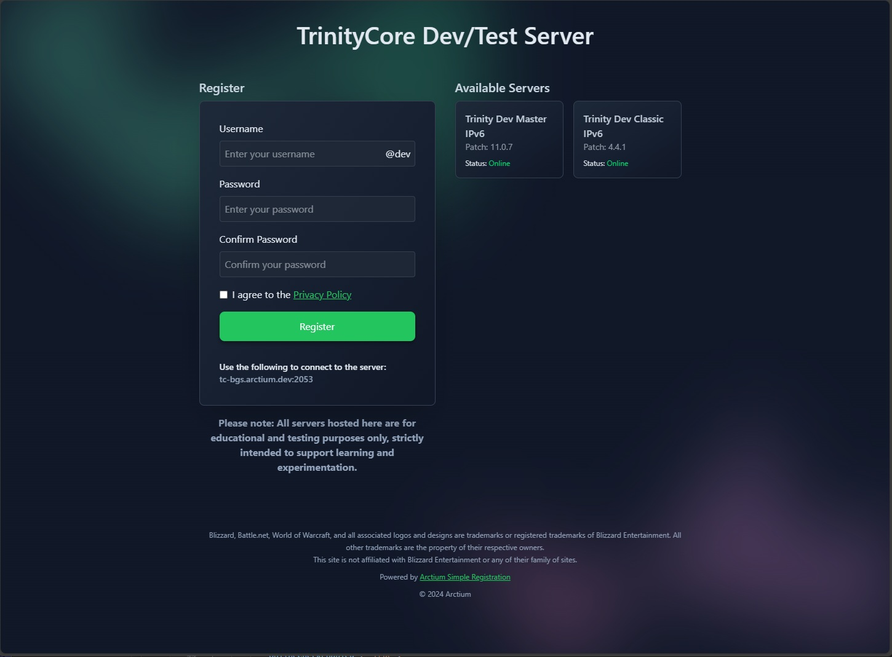

# Simple Registration
Simple Registration serves as registration site using **Blazor Server Side** for your game (test) servers.

**Note: Everything is still Work in Progress, so expect changes to configuration options and other things!**

### License, Copyright & Contributions
Please see our Open Source project [Documentation Repo](https://github.com/Arctium/Documentation)

## Features
* Simple registration system with username & password.
* Registration is configured using simple registration services.
* Comes with `green` (default) and `amber` color themes. Easy to adjust in the `app.css` file.
* Static server list with minimal information (can be toggled on/off).
* The option to add a disclaimer & privacy policy.

### Build Prerequisites
* [.NET 9 SDK or later](https://dotnet.microsoft.com/download/dotnet/9.0)
* Optional: [Tailwind CSS 4.0 (Beta)](https://tailwindcss.com/docs/v4-beta). This is only required to generate new css files for custom styles/themes.

If customization is required install Tailwind CSS using in the source folder:
* `npm install tailwindcss@next @tailwindcss/cli@next`

To generate a new `tailwind.css` file execute this in the source folder:
* `npx @tailwindcss/cli -i tailwind.input.css -o wwwroot/css/tailwind.css`

### Usage
**Note**: It is recommended to use a reverse proxy in front of a Blazor application. One popular choice is [nginx](https://nginx.org/).

1. Clone the repository.
2. Run the application using `dotnet run`.

That is enough to get the site running for local development. For easier development use an IDE such as Visual Studio or Rider.

### Configuration
Configuration happens in the shipped `appsettings.json`.

* **ColorTheme**: The default color theme used for the website. Valid options are `green`, `amber`.
* **SiteTitle**: Title on the registration site. Supports html tags.
* **Disclaimer**: A disclaimer for things like trademark notices etc. that is shown in the footer.
* **PrivacyPolicyLink**: Sets a privacy policy link if required by law or other transparency reasons. Hidden if empty.
* **GameServerHost**: This is the host name or ip address of the game server(s).
* **RegistrationService**: Sets the registration provider. Has to match the class name of the provider.
* **ShowServers**: Enables the server list defined in the `AvailableServers` option.

#### RegistrationSettings
* **UserNameSuffix**: This appends a suffix to the user name. Visually and in the registration request.

#### SoapRegistrationService for TrinityCore
* **Protocol**: `http` is required. Do not change.
* **HttpClientSettings:Host**: The host/ip of the TrinityCore SOAP server.
* **Credentials**: Your SOAP credentials. Visit the TrinityCore documentation for more info about that.
* **Timeout**: Request timeout in milliseconds.

#### AvailableServers
* **ServerName**: Title of the server in the list.
* **Patch**: Required game client version to use the server.
* **OnlineCheckEnabled**: Enables a TCP connection check to given `ServerAddress` & `ServerPort`
* **ServerAddress**: The game server IP address. **Only used for online checks**
* **ServerPort**: The game server port. **Only usedfor online checks**

### Registration Services
The app supports multiple registration providers, such as SOAP (used for [TrinityCore](https://github.com/TrinityCore/TrinityCore)) for testing purposes. You can easily switch between these in the configuration.

New registration providers can be added in the `src/Services` folder. For an example look at the existing `SoapRegistrationService` provider.

`Protocol` is a 'special' configuration option that registration providers can use. If set to `http` or `https` a default named HttpClient service is registered so you can use those in your service class through DI. If that is set you also need the `HttpClientSettings:Host` setting (see `SoapRegistrationService` settings) as setting.

Otherwise you are free to choose your configuration fields for the registration providers.
